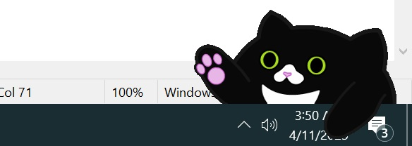

# ~Typing kitty example

No copyright claimed. 
Released under the MIT License. 
Author: Michael E. Jolley 

## Description
This is a short example piece of code, demonstrating one way to create a "Bongo Cat"-like desktop widget. It sits in the corner of the user's screen as a top-most window with transparency. When the user types or presses keys in the pre-defined set, it animates by showing frames for each paw being up or down. Which paw goes down is pseudorandom.

Since both the widget and the taskbar are competing to be the top-most window, it may occasionally be overlapped by the taskbar. Clicking on the widget should bring it back to the front.

The cat can be repositioned by clicking and dragging. Its position can be reset using the context-menu by right-clicking on the widget or the accompanying sys-tray icon. The same context menu can also be used to close/exit the application.

### Disclaimer
You will see the spelling, "pkitty", in a few places throughout the project. This spelling is a reference to the real-world cat's name, whom the artwork depicts.